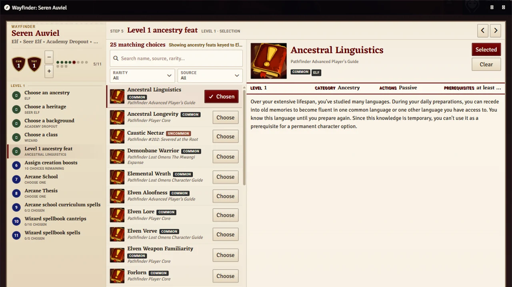
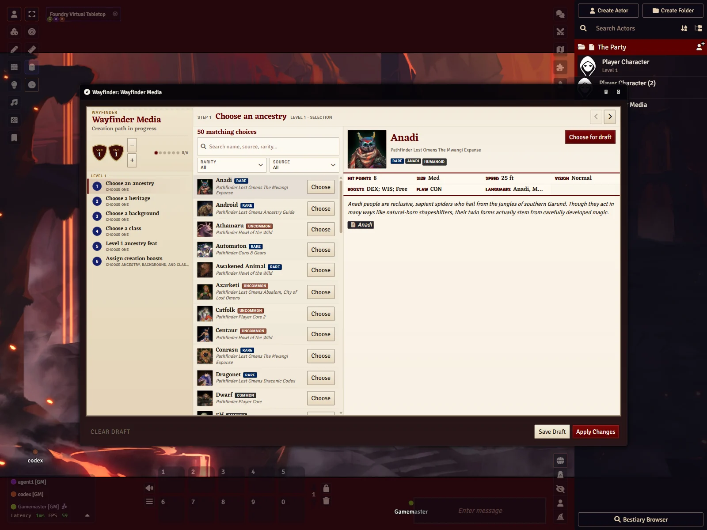
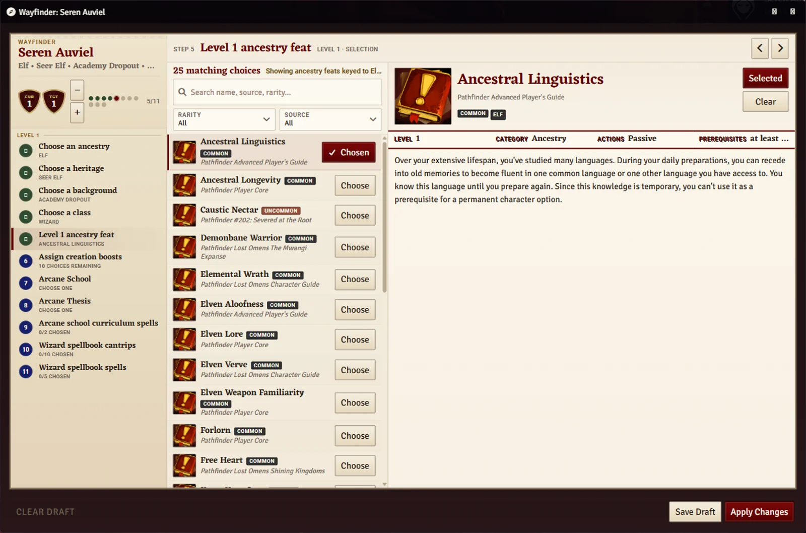
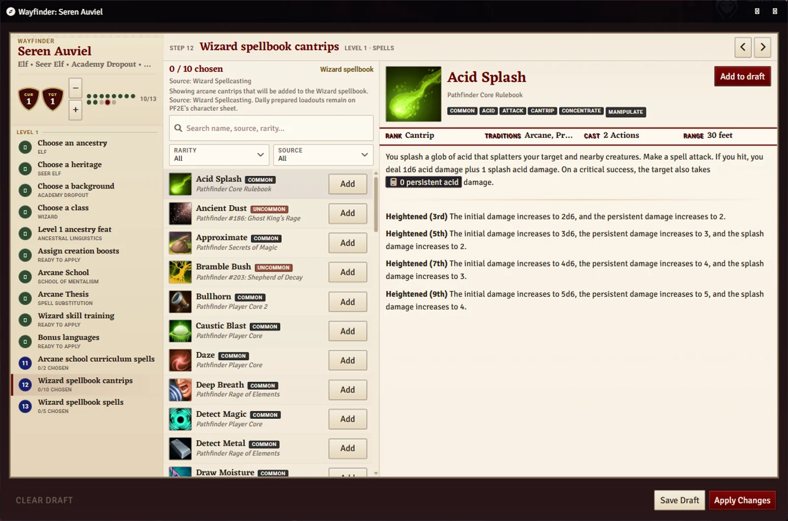
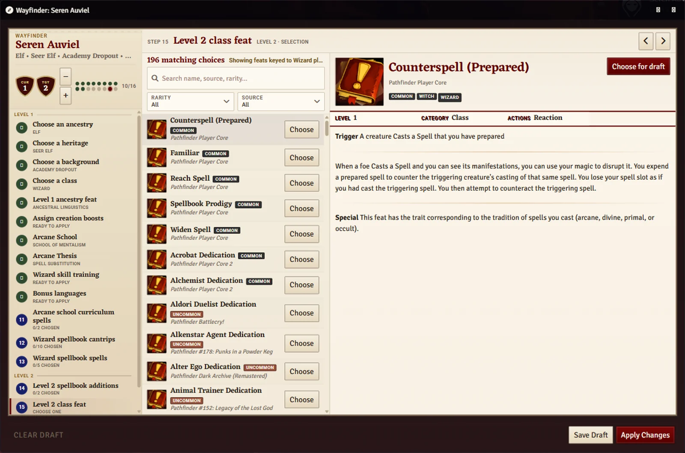

<div align="center">

# Wayfinder

**A guided Pathfinder 2e character builder, built into Foundry VTT.**

[](https://github.com/bestlux/wayfinder/releases/latest)


[](LICENSE.md)



</div>

Character creation and leveling in PF2E means juggling class tables, compendium browsers, feat slots, boosts, spell lists, and source exceptions. Wayfinder turns all of that into a single guided flow you open straight from the character sheet — think Pathbuilder, but living inside your game world. It knows which sources your GM enabled, filters every picker by what you can actually take, and writes the result directly to the actor. No JSON export, no re-import, no sheet-mismatch cleanup.

## Highlights

- **One flow from level 1 to level up.** Ancestry, heritage, background, class, class branches, feats, boosts, skill increases, languages, and spell choices — all in order, in one window.
- **Dedicated class-archetype decisions.** Battle Creed is guided as a complete Cleric progression profile instead of being treated as an ordinary Doctrine option.
- **Earlier picks filter later ones.** You stop scrolling past feats and options you can't take anyway.
- **Beginner-friendly, veteran-fast.** Each step explains what you're choosing; experienced players just search, pick, next.
- **Respects your table.** Rarity and source filters on every picker, with optional GM allowlists for non-official packs.
- **Resumable drafts.** Progress is saved on the actor, so you can leave mid-build and come back later.
- **Honest about its limits.** When Wayfinder can't model a step confidently, it says so and points you at the right native PF2E control instead of silently guessing.

## Screenshots

| | |
| :---: | :---: |
|  |  |
| *Guided level-1 creation — ancestry through boosts in one flow* | *Feat picker with rarity and source filters* |
|  |  |
| *Spell choices land in the right spellcasting entry* | *Level-up drafts surface only what you still need to choose* |

## Installation

Paste this manifest URL into Foundry's **Install Module** dialog:

```text
https://github.com/bestlux/wayfinder/releases/latest/download/module.json
```

Foundry's package updater will follow it for future versions. Older releases stay installable from their own [release pages](https://github.com/bestlux/wayfinder/releases).

**Requirements:** Foundry VTT v14 with the PF2E system (8.1 or newer). The current release is verified against Foundry VTT 14.364 and PF2E 8.2.0. The development branch's Battle Creed lane is additionally smoke-verified against PF2E 8.3.0.

## Using Wayfinder

1. Open an owned PF2E character actor.
2. Click the **Wayfinder** action in the sheet header.
3. Walk the steps. Drafts save as you go.
4. Apply when you're ready — Wayfinder writes the changes to the actor.

Wayfinder is a planning layer on top of the PF2E system, not a replacement for it. The actor and its items remain the source of truth; Wayfinder's job is to get you to a clean, valid state without clicking through twelve places to do it.

## Class support

Every one of the 27 PF2E classes has a verified guided path from a blank level-1 character through level 5 — including class branches (instincts, doctrines, bloodlines, mysteries, and the rest), feat milestones, skill training, boosts, and spellcasting setup for prepared, spontaneous, spellbook, and bounded casters.

Battle Creed is the first guided class-archetype profile. Wayfinder handles its Doctrine replacement, level-2 Battle Harbinger Dedication, prepared-spell progression, Battle Font, nested skill choice, and conflicting static Toughness grant as one dedicated progression lane. Other class archetypes remain filtered until they have the same end-to-end support.

<details>
<summary><strong>All 27 classes, verified through level 5</strong></summary>

Alchemist · Animist · Barbarian · Bard · Champion · Cleric · Commander · Druid · Exemplar · Fighter · Guardian · Gunslinger · Inventor · Investigator · Kineticist · Magus · Monk · Oracle · Psychic · Ranger · Rogue · Sorcerer · Summoner · Swashbuckler · Thaumaturge · Witch · Wizard

Each class is verified by a live in-Foundry test that builds a character from blank level 1 to level 5 and applies it to the actor. That is one deterministic legal path per class — not exhaustive proof of every subclass, variant, or book option.

</details>

> **Status: beta.** Wayfinder is early-access software built slice by slice. If you want the fine print on exactly which choice shapes are guided today, the [level-1 coverage matrix](docs/coverage/level1-coverage-matrix.md), [level-up coverage matrix](docs/coverage/levelup-coverage-matrix.md), and [live smoke results](docs/coverage/beta-readiness-smoke.md) are the honest answer to "does it support my build yet."

### Not covered (yet)

These stay in the native PF2E sheet for now, and Wayfinder will tell you so when they come up:

- Starting gear and item purchasing
- Daily preparations
- Free Archetype and class archetypes other than Battle Creed
- Retraining and table-specific campaign systems

## Feedback

Bug reports and feature requests: [GitHub issues](https://github.com/bestlux/wayfinder/issues). You can also reach the maintainer on Discord: `bestlux`.

When reporting a bug, the Foundry version, PF2E system version, and the class/ancestry combination involved make it much faster to reproduce.

## Development

Build, test, local-linking, and smoke-harness instructions live in [docs/development.md](docs/development.md). Release packaging is documented in [docs/release-packaging.md](docs/release-packaging.md).

## License & credits

Wayfinder is distributed under the terms in [LICENSE.md](LICENSE.md). It is currently all-rights-reserved software with permission to install and run the published module in Foundry Virtual Tabletop.

Wayfinder does not redistribute PF2E compendium data. It reads from the installed PF2E system and reuses the system's actor/item application paths wherever it can.

Pathfinder Second Edition and related trademarks are owned by Paizo Inc. Foundry Virtual Tabletop is owned by Foundry Gaming LLC. Wayfinder is an independent module, not affiliated with or endorsed by either.
