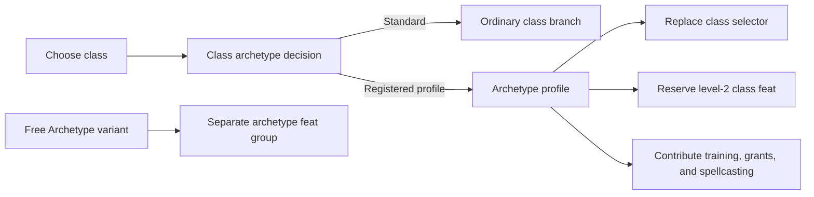

# Class archetype lane

This document defines how Wayfinder guides PF2E class archetypes without mixing them into ordinary subclass choices or campaign-variant feat slots. It is an implementation contract for contributors adding another class-archetype profile.

## Current scope and evidence

Three profiles are registered and guided through level 5:

- Cleric **Battle Creed** replaces Doctrine, reserves the level-2 class feat for Battle Harbinger Dedication, changes prepared-spell progression, creates Battle Font, and handles skill/static-grant fallbacks.
- Gunslinger **Way of the Spellshot** replaces Gunslinger's Way, reserves the level-2 class feat for Spellshot Dedication, projects its class-feature and dedication training, and creates an Intelligence-based arcane spellbook with four cantrips and two open cantrip preparation positions.
- Investigator **Palatine Detective** replaces Methodology, persists its Occultism-or-Religion choice, reserves the level-2 class feat for Palatine Detective Dedication, and creates separate Intelligence-based divine and occult innate cantrip entries.

The release matrix passed live apply/rerun smoke on 2026-07-11 against Foundry VTT 14.364 and PF2E 8.3.0: 35 direct level-1-to-5 cases plus seven incremental existing-character cases, with 42 passing, zero classified/manual, and zero failed. Direct and incremental cases cover all three registered profiles; Battle Creed also retains its skill and static-grant fallback cases. Artifact: `.wayfinder-smoke/release-0.4.0-full-4`.

## Why this is a separate lane

A class archetype is a level-1 class-construction decision. It can replace class features, change spellcasting, reserve later class-feat slots, and grant a dedication. An ordinary class branch only chooses one option under an existing selector; it does not own those cross-cutting changes.

Free Archetype is different again. It is a campaign variant that adds PF2E's separate `archetype` feat group at even levels. It must remain a future progression lane and must not consume or replace normal class-feat slots.

## Domain contract

The lane uses its own `class-archetype` step and slot kind. A draft stores an explicit string value in `classArchetypeChoices`:

- `standard` means the user deliberately chose the normal class progression;
- a registered profile value such as `battle-creed`, `way-of-the-spellshot`, or `palatine-detective` activates that profile;
- no stored value means the decision is unanswered.

This three-state distinction is required. Treating an omitted choice as Standard would hide an important character-building decision, while treating a class archetype as an ordinary branch would apply it too late for PF2E feature suppression.

Changing the base class clears the class-archetype decision. Changing the class-archetype decision invalidates dependent class branches, class-feature choices, training, spells, and class-feat selections.

Draft version 8 migrates a legacy Battle Creed selection out of `branchSelections` and into `classArchetypeChoices`.

## Profile contract

A profile in `src/wayfinder/class-archetype/registry.ts` owns the policy that cannot be inferred from a normal selector alone:

| Field | Responsibility |
| --- | --- |
| Class slug and selector tag | Attach the profile to the correct class selector. |
| Selection reference | Identify the class-archetype class feature created with the class. |
| Reserved class-feat levels | Remove forced archetype feats from ordinary class-feat drafting without consuming later milestones. |
| Projected feat grants | Expose a not-yet-created dedication to training, choice, spell, prerequisite, and duplicate-filtering logic. |
| Internal class-feature choices | Satisfy obsolete or implementation-only PF2E `ChoiceSet` rules without asking the user a false character-build question. |
| Class-specific contributors | Apply spellcasting or other subsystem adjustments whose rules are descriptive rather than structured data. |

Registration is intentionally explicit. PF2E's `class-archetype` tag identifies candidates, but each profile still needs evidence for its suppressed features, forced feats, nested choices, apply order, and class-specific mechanics before Wayfinder exposes it.

## Planning behavior

1. Discover the class's ordinary item-backed branch selectors.
2. Match registered class-archetype profiles to a selector's class slug and option tag.
3. Emit one required class-archetype step before the replaced branch step.
4. Withhold the ordinary branch until `standard` is explicit.
5. If a profile is selected, project its source and level-gated grants into downstream planning.
6. Reserve profile-owned class-feat slots independently from fulfilled actor slots.
7. Keep unregistered class-archetype options filtered out of ordinary branch pickers.

Selected class-feature sources and projected dedications both enter the training lane. This keeps skill-shaped `ChoiceSet` rules in one workflow for blank actors and existing-class actors. For Battle Creed, the projected Battle Harbinger Dedication supplies its Acrobatics-or-Athletics choice; if both are already trained, the fallback allows another skill. Spellshot likewise accounts for Arcana before resolving its dedication fallback, while Palatine Detective persists its Occultism-or-Religion selection on the profile item.

## Apply order

PF2E class-archetype suppression depends on creation order. The apply path must preserve this sequence:

1. Strip the replaced selector and internally owned class features from the drafted class source.
2. Create the class and selected class-archetype source in one `createEmbeddedDocuments` batch.
3. Apply projected training choices before materializing forced grants.
4. Recreate the selector item and link it to the existing archetype through selector adoption.
5. Create any internally owned class feature with its `ChoiceSet` preselected.
6. Apply ordinary class branches and other class-feature choices.
7. Synchronize native spellcasting entries and spells.
8. Update actor level so PF2E can reevaluate later profile grants.

Selector adoption is the critical invariant: it links the replaced selector to the already-created profile instead of granting a duplicate profile item.

## Battle Creed mechanics

Battle Creed has two spellcasting entries:

- **Divine Prepared Spells** follows the Battle Harbinger table: five cantrips, one 1st-rank slot at level 1, two 1st-rank slots at level 2, and then at most two slots in each of the highest two spell ranks.
- **Battle Font** is a prepared divine entry using the Cleric class DC. It contains Bane and Bless as available spells, starts with empty daily-preparation slots, and preserves valid daily preparation on same-rank reruns.

Battle Font is not a permanent Bane-versus-Bless character choice. The player can prepare either spell, including duplicates, during daily preparation. Wayfinder therefore creates both spell documents and leaves the font slots empty.

At level 2, Battle Harbinger Dedication occupies `class-feat-level-2`. The next ordinary Cleric class feat remains available at level 4.

## Way of the Spellshot mechanics

Way of the Spellshot replaces the ordinary Gunslinger's Way selection. Its class feature supplies Thoughtful Reload, Energy Shot, Arcana training, and the Intelligence class-DC adjustment through PF2E rules. Spellshot Dedication occupies `class-feat-level-2`; the level-4 Gunslinger class feat remains available.

The profile contributor creates a keyed **Spellshot Spellbook** with four selected common arcane cantrips and exactly two open cantrip preparation positions. Its destination is key-only: Wayfinder will create or reuse its own keyed entry and will not adopt an unrelated arcane prepared entry merely because tradition, ability, and preparation type match.

## Palatine Detective mechanics

Palatine Detective replaces Investigator Methodology. Its profile `ChoiceSet` is routed through skill training so the chosen Occultism or Religion value is persisted before PF2E creates the item. The profile also grants Quick Identification. Palatine Detective Dedication occupies `class-feat-level-2`, grants Mystic Aegis, and leaves the level-4 Investigator class feat available.

The profile contributor creates one common divine innate cantrip and one common occult innate cantrip, both using Intelligence. These are distinct keyed entries. The same spell can legally be selected for both traditions; duplicate prevention is therefore scoped to a destination rather than to the entire actor.

## Free Archetype extension boundary

Free Archetype should be implemented as a separate variant progression contributor with these invariants:

- detect the active PF2E variant setting from live game state;
- read and write the actor's separate `archetype` feat group;
- create additional even-level archetype-feat steps without altering `classFeatLevels`;
- share dedication prerequisite and duplicate filtering with ordinary feat lanes;
- keep class-archetype forced feats in whichever slot PF2E rules name. Battle Harbinger Dedication remains a normal level-2 class feat even when Free Archetype is enabled.

The current class-archetype registry and projected-feat context are reusable inputs for that future lane, but they do not themselves enable Free Archetype.

## Acceptance gates

Automated merge gates:

- Each affected class retains an explicit Standard path and its ordinary selector behavior.
- Selecting a registered profile hides the replaced selector branch and reserves only the configured class-feat levels.
- Class and profile share the initial creation batch, and selector adoption produces exactly one profile item.
- Selected profile/class-feature training and projected dedication choices persist without PF2E-native choice dialogs, including existing-class actor paths.
- Battle Creed prepared slots, Battle Font, skill fallback, and Toughness replacement remain covered.
- Spellshot has four arcane cantrips, exactly two open cantrip preparation positions, an Intelligence-based keyed entry, and no unrelated entry adoption.
- Palatine Detective has its chosen skill, two keyed innate entries, and permits the same legal cantrip in both traditions.
- Level 4 retains the ordinary class-feat step for all three profiles.
- Draft migration, invalidation, pane actions, explicit Standard completion, direct apply, incremental apply, and zero-step reruns remain covered.

Live release gates completed on 2026-07-11:

1. Run every maintained direct level-1-to-5 class/variant case, including Standard Cleric/Gunslinger/Investigator and all three profile paths.
2. Run incremental level-1-to-5 cases for Fighter, Cleric, Sorcerer, Kineticist, Battle Creed, Spellshot, and Palatine Detective.
3. Verify 42 pass, zero classified/manual, zero fail, zero native dialog increases, no invalid duplicate source IDs, draft cleanup, and zero pending rerun steps.
4. Inspect profile-specific actor evidence for forced-feat location, selected rule values, class-feat preservation, exact spellcasting entry identity/capacity, and spell destination.
5. Retain Battle Creed's both-skills-trained, actor-owned Toughness, and same-draft Shielded Fortune conflict cases.

The consolidated release artifact is `.wayfinder-smoke/release-0.4.0-full-4`.

## Adding another class archetype

Before registering another profile:

1. Inspect its current PF2E pack source and the replaced class selector.
2. Record suppressed features, forced feat slots, static and conditional grants, nested choices, and any descriptive-only subsystem changes.
3. Add the smallest profile policy and class contributor needed for those mechanics.
4. Add Standard-path regression tests and archetype-specific planning, apply, and rerun tests.
5. Run a live blank-to-target apply and rerun before changing public support claims.

Do not register an archetype solely because it has the `class-archetype` tag. Registration is a support claim for the complete profile, not just picker visibility.
