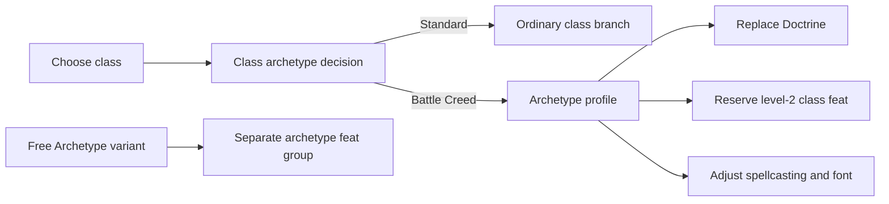

# Class archetype lane

This document defines how Wayfinder guides PF2E class archetypes without mixing them into ordinary subclass choices or campaign-variant feat slots. It is an implementation contract for contributors adding another class-archetype profile.

## Current scope and evidence

The first supported profile is Cleric's **Battle Creed**. The source implementation and automated tests cover:

- an explicit **Standard class path** versus **Battle Creed** decision at level 1;
- Doctrine replacement without exposing Battle Creed in the ordinary Doctrine picker;
- same-batch class and class-archetype creation so PF2E suppression runs at creation time;
- Doctrine adoption of the already-created Battle Creed item, with no duplicate grant;
- Battle Harbinger Dedication in the level-2 class-feat slot, including its skill choice and fallback;
- Battle Creed prepared-spell progression and a PF2E-native Battle Font containing Bane and Bless;
- legacy draft migration from a Doctrine branch selection into the dedicated lane.

The lane passed live apply/rerun smoke on 2026-07-11 against Foundry VTT 14.364 and PF2E 8.3.0. The verified cases cover Standard Cleric, direct Battle Creed creation, incremental Battle Creed level 1 to level 5, the both-dedication-skills-trained fallback, an actor-owned Toughness conflict, and a same-draft Shielded Fortune grant conflict. The consolidated artifact is `.wayfinder-smoke/class-archetype-final-2`.

## Why this is a separate lane

A class archetype is a level-1 class-construction decision. It can replace class features, change spellcasting, reserve later class-feat slots, and grant a dedication. An ordinary class branch only chooses one option under an existing selector; it does not own those cross-cutting changes.

Free Archetype is different again. It is a campaign variant that adds PF2E's separate `archetype` feat group at even levels. It must remain a future progression lane and must not consume or replace normal class-feat slots.

## Domain contract

The lane uses its own `class-archetype` step and slot kind. A draft stores an explicit string value in `classArchetypeChoices`:

- `standard` means the user deliberately chose the normal class progression;
- a registered profile value such as `battle-creed` activates that profile;
- no stored value means the decision is unanswered.

This three-state distinction is required. Treating an omitted choice as Standard would hide an important character-building decision, while treating a class archetype as an ordinary branch would apply it too late for PF2E feature suppression.

Changing the base class clears the class-archetype decision. Changing the class-archetype decision invalidates dependent class branches, class-feature choices, training, spells, and class-feat selections.

Draft version 8 migrates a legacy Battle Creed selection out of `branchSelections` and into `classArchetypeChoices`.

## Profile contract

A profile in `src/wayfinder/class-archetype/registry.ts` owns the policy that cannot be inferred from a normal selector alone:

| Field | Responsibility |
| --- | --- |
| Class slug and selector tag | Attach the profile to the correct class selector. |
| Selection reference | Identify the class-archetype class feature created with the class. |
| Reserved class-feat levels | Remove forced archetype feats from ordinary class-feat drafting without consuming later milestones. |
| Projected feat grants | Expose a not-yet-created dedication to training, choice, spell, prerequisite, and duplicate-filtering logic. |
| Internal class-feature choices | Satisfy obsolete or implementation-only PF2E `ChoiceSet` rules without asking the user a false character-build question. |
| Class-specific contributors | Apply spellcasting or other subsystem adjustments whose rules are descriptive rather than structured data. |

Registration is intentionally explicit. PF2E's `class-archetype` tag identifies candidates, but each profile still needs evidence for its suppressed features, forced feats, nested choices, apply order, and class-specific mechanics before Wayfinder exposes it.

## Planning behavior

1. Discover the class's ordinary item-backed branch selectors.
2. Match registered class-archetype profiles to a selector's class slug and option tag.
3. Emit one required class-archetype step before the replaced branch step.
4. Withhold the ordinary branch until `standard` is explicit.
5. If a profile is selected, project its source and level-gated grants into downstream planning.
6. Reserve profile-owned class-feat slots independently from fulfilled actor slots.
7. Keep unregistered class-archetype options filtered out of ordinary branch pickers.

For Battle Creed, the projected Battle Harbinger Dedication supplies its Acrobatics-or-Athletics choice to class training at level 2. If both are already trained, the existing skill-choice fallback allows another skill and persists that value into the dedication's PF2E rule selection.

## Apply order

PF2E class-archetype suppression depends on creation order. The apply path must preserve this sequence:

1. Strip the replaced selector and internally owned class features from the drafted class source.
2. Create the class and selected class-archetype source in one `createEmbeddedDocuments` batch.
3. Apply projected training choices before materializing forced grants.
4. Recreate the selector item and link it to the existing archetype through selector adoption.
5. Create any internally owned class feature with its `ChoiceSet` preselected.
6. Apply ordinary class branches and other class-feature choices.
7. Synchronize native spellcasting entries and spells.
8. Update actor level so PF2E can reevaluate later profile grants.

Selector adoption is the critical invariant: it links Doctrine to Battle Creed instead of granting a second Battle Creed item.

## Battle Creed mechanics

Battle Creed has two spellcasting entries:

- **Divine Prepared Spells** follows the Battle Harbinger table: five cantrips, one 1st-rank slot at level 1, two 1st-rank slots at level 2, and then at most two slots in each of the highest two spell ranks.
- **Battle Font** is a prepared divine entry using the Cleric class DC. It contains Bane and Bless as available spells, starts with empty daily-preparation slots, and preserves valid daily preparation on same-rank reruns.

Battle Font is not a permanent Bane-versus-Bless character choice. The player can prepare either spell, including duplicates, during daily preparation. Wayfinder therefore creates both spell documents and leaves the font slots empty.

At level 2, Battle Harbinger Dedication occupies `class-feat-level-2`. The next ordinary Cleric class feat remains available at level 4.

## Free Archetype extension boundary

Free Archetype should be implemented as a separate variant progression contributor with these invariants:

- detect the active PF2E variant setting from live game state;
- read and write the actor's separate `archetype` feat group;
- create additional even-level archetype-feat steps without altering `classFeatLevels`;
- share dedication prerequisite and duplicate filtering with ordinary feat lanes;
- keep class-archetype forced feats in whichever slot PF2E rules name. Battle Harbinger Dedication remains a normal level-2 class feat even when Free Archetype is enabled.

The current class-archetype registry and projected-feat context are reusable inputs for that future lane, but they do not themselves enable Free Archetype.

## Acceptance gates

Automated merge gates:

- Standard Cleric still exposes Doctrine, standard prepared slots, and Heal/Harm Divine Font behavior.
- Battle Creed hides Doctrine and the obsolete Divine Font build choice.
- Class and Battle Creed share the initial creation batch.
- Doctrine adopts exactly one Battle Creed item.
- Level 2 creates one Battle Harbinger Dedication in `class-2`, with its chosen skill persisted.
- Level 4 retains its ordinary class-feat step.
- Battle Creed spell choices, prepared slots, Battle Font spells, and rerun preservation match PF2E data.
- Draft migration, invalidation, pane actions, and explicit Standard completion remain covered.

Live release gates, completed on 2026-07-11:

1. Blank actor to level 5 with Standard Cleric, apply, then rerun with no pending steps or native choice dialogs.
2. Blank actor to level 5 with Battle Creed, apply, then rerun with no duplicate Doctrine, Battle Creed, dedication, font entry, or font spell.
3. Inspect actor evidence for suppressed Doctrine progression, dedication location and skill selection, exact prepared slots, Battle Font class-DC proficiency, and Bane/Bless availability.
4. Run an incremental Battle Creed level 1 to level 5 case to prove stale lower-rank prepared slots are removed.
5. Start with both Acrobatics and Athletics trained and prove another selected skill is persisted into the dedication without a native choice dialog.
6. Start with actor-owned Toughness and prove the dedication's static grant is replaced by the drafted fallback feat without duplicating Toughness or consuming the ordinary general-feat slot.
7. Draft Shielded Fortune and prove its pending Toughness grant triggers the same fallback while the ordinary level-3 general-feat slot remains independent.

The direct and incremental cases verified exact level-5 Battle Creed spell slots, Bane and Bless in Battle Font, no native choice dialogs, no duplicate source items, draft cleanup, and zero pending rerun steps.

## Adding another class archetype

Before registering another profile:

1. Inspect its current PF2E pack source and the replaced class selector.
2. Record suppressed features, forced feat slots, static and conditional grants, nested choices, and any descriptive-only subsystem changes.
3. Add the smallest profile policy and class contributor needed for those mechanics.
4. Add Standard-path regression tests and archetype-specific planning, apply, and rerun tests.
5. Run a live blank-to-target apply and rerun before changing public support claims.

Do not register an archetype solely because it has the `class-archetype` tag. Registration is a support claim for the complete profile, not just picker visibility.
